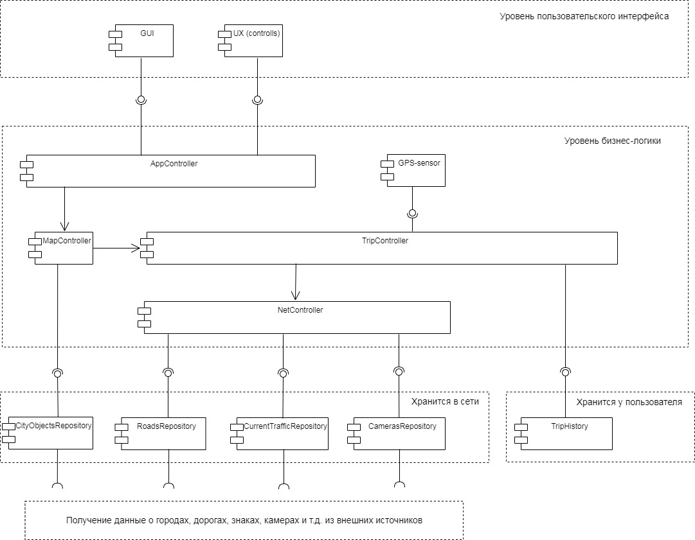

# Урок 5. Горизонтальные уровни и вертикальные срезы архитектуры

## Cформировать UML-диаграмму, отвечающую задаче.

Необходимо разделить на горизонтальные уровни «Редактор 3D графики”. 

Один пользователь. Программа работает на одном компьютере без выхода в сеть.

Что видит пользователь, как взаимодействует? (Панель загрузки, блок редактирования, блок просмотра …).

Какие задачи можно делать – функции системы? (Загрузить 3D модель, рассмотреть 3D модель, создать новую, редактировать вершины, текстуры, сделать рендер, сохранить рендер… ).

Какие и где хранятся данные? (файлы 3D моделей, рендеры, анимация .., в файловой системе компьютера).

См. файл с диаграммой 

См. файл диаграммы [UMLdrawio.drawio](./UMLdrawio.drawio) с исходным кодом для сайта
[draw.io](https://www.draw.io)

### Предложить варианты связывания всех уровней – сценарии использования. 3-4 сценария.

Сквозная функция – создать новую 3D модель, сделать рендер для печати на принтере…

## Реализовать архитектуру из приложенной UML-диаграммы к уроку

См файл с диаграммой 

### Слой взаимодействия с пользователем

См. файлы в папке [userInterface](./userInterface)

### Слой бизнес логики

См. файлы в папке [middleware](./middleware)

### Слой данных

См. файлы в папке [core](./core)
