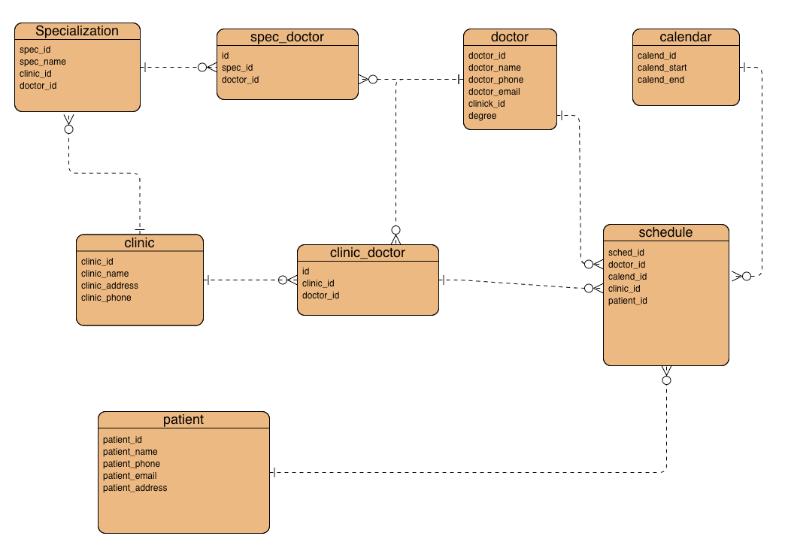

# Урок 6. Принципы построения приложений «чистая архитектура»

## Доменную модель реализовать в виде реляционной ER диаграммы для БД 

для: клиники, доктора и услуги.

Это очень упрощенная реляционная модель данных.

Годится только для того, чтобы записаться на прием к врачу.

По дефолту можно ставить **0** для поля **patient_id** в таблице **schedule**

Даже на такой маленькой задаче требуется много проверок перед записью данных в таблицы на их непротиворечивость.

## Кратко таблицы

Один доктор может работать в нескольких клиниках.

**specialization** - специализации врачей - окулист, гинеколог и т.д. 

Один доктор может иметь несколько специализаций.

**calendar** - дискретный список приемов, т.е.

дата-время начала - дата-время окончания.
