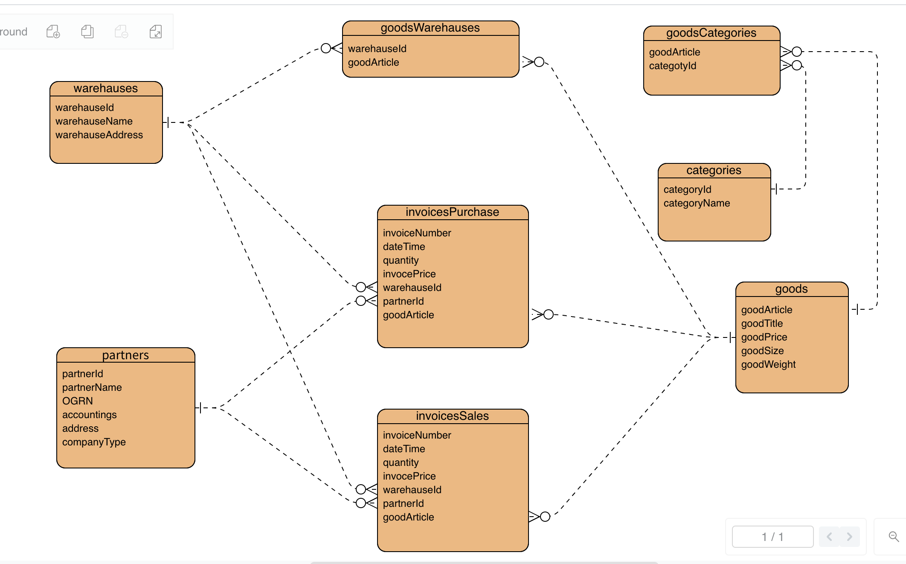

# Урок 7. ER-model компании оптовой торговли.

Спроектировать ER-model для компании оптовой торговли.

Компания имеет юридические и банковские реквизиты точно также, как и другие юрлица - все по законодательству. 

Поэтому в таблице "контрагенты" её можно занести например с id 0.

## Примерное содержание таблицы "контрагенты"

- id
- лица (физ, юр: ип, чп, зао, оао)
- наименование
- ОГРН
- адрес
- банковские реквизиты

## Склады

У оптовой торговли есть склады - для них своя таблица.

Склады
- адрес
- наименование

## Категории товаров

Товары обычно сгруппированы по категориям. Нужна таблица - рубрикатор товаров.

категории товаров
- наименование раздела

Например, — утеплители, уплотнители.

Один и тот же товар может быть в нескольких категориях.

## Товары

Для товаров своя таблица.

Товары
- склад
- артикул
- цена за ед
- наименование
- размер
- плотность
- вес

## Счет-фактуры

Все сделки покупки и продажи обязательно фиксируются в счет-фактурах.

Счет-фактуры обязательна для налогового органа.

Отдельно ведется Книга покупок - это 60 счет и отдельно Книга продаж - это 62 счет.

Поэтому покупки и продажи записываем в разные таблицы.

Счет-фактуры
- дата
- номер счет-фактуры
- контрагент id
- артикул товара
- количество
- цена
- склад

## ER-model

