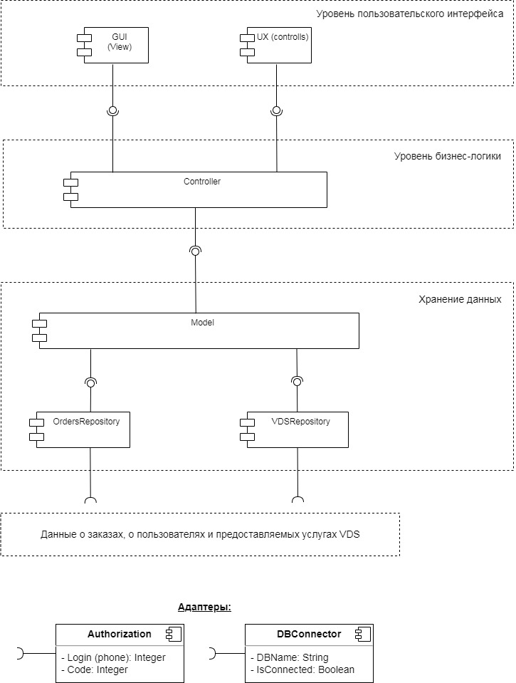
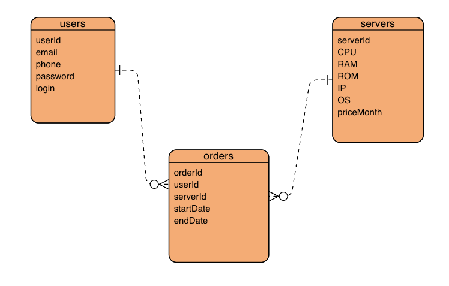

# Урок 9. Способы организации передачи данных между компонентами приложения, протоколы и API. REST, gRPC, очереди

Разработать полную ERD домена, по UML-диаграмме из урока

## ER-model

Необходимо спроектировать контракт API для приложения заказа (создания) ресурсов в облачном сервере.

CPU, RAM, ROM, IP address, OS

### users

Таблица пользователей хранит данные о пользователях - заказчиках серверов.

### servers

Таблица серверов хранит конфигурации серверов, которые заказывают и цены на эти сервера за месяц.

### orders

Таблица заказов хранит данные о заказе.

Кто арендовал,

Какой сервер арендовал,

На какой срок арендовал.