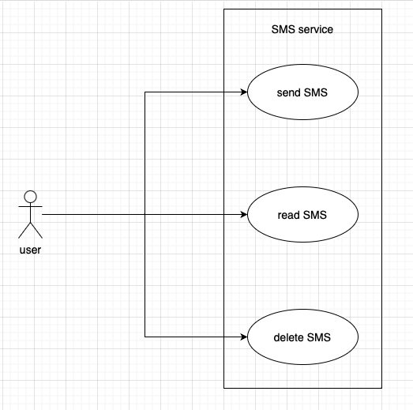
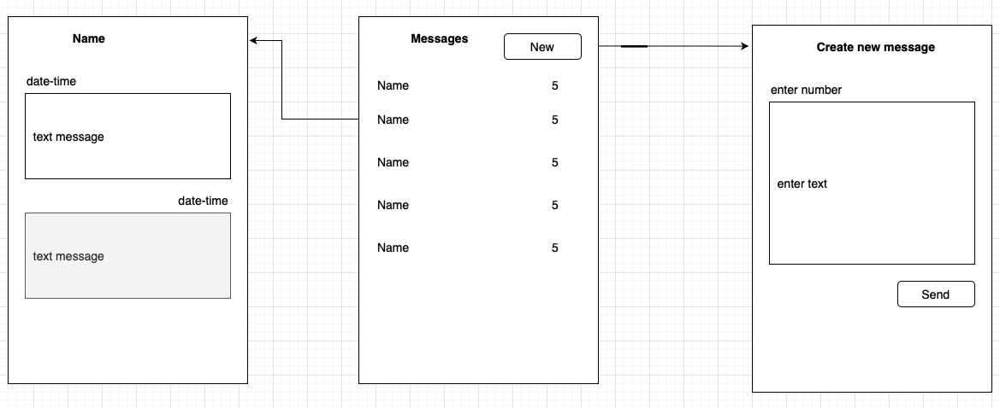
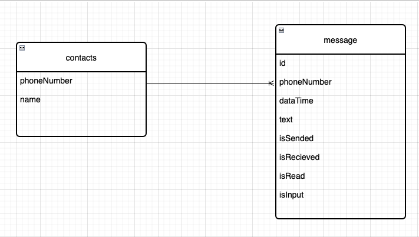

# Урок 10. Структура приложения с пользовательским интерфейсом и базой данных (паттерн Repository)

Разработать приложение мессенджера (на выбор desktop/web/mobile). 

Требуется написать use case диаграмму, выбрать архитектуру для приложения (кратко обосновать выбор), 

UML и ER диаграммы для выбранной архитектуры. Используя метод персон (не менее 3), 

описать каких функций не хватает. Пересмотреть UML и ER диаграммы с учетом недостатков. 

Создать интерфейс в figma для приложения.

## Упрощение задачи до СМС

Задача мессенджера очень объемная и не может быть сделана студентом в рамках трех уроков.

Давно уже золотым стандартом в такого рода ПО стал **Телеграм**.

Даже на простое описание его функций по скриншотам потребуется сильно много времени, не говоря уже об уровне и количестве разработчиков.

Для начала попробуем спроектировать очень простое ПО, которое отправляет СМСки на мобильных телефонах.

Таким образом задачи регистрации и авторизации остаются за рамками разработки.

Также не рассматриваем серверные логи, для простоты задачи принимаем, что все СМС хранятся на телефоне пользователя.

Выбираем наипростейшую архитектуру MVC, предложенную компанией Apple еще на заре их работы.

## use case diagram

Пользователь может отправлять смски, читать их, удалять.

## интерфейс пользователя схематично

Пользователь видит список контактов, по которым у него уже есть смски. И может создать новое сообщение.

В окне создания нового сообщения пользователь должен ввести номер телефона абонента и текст сообщения.

При выборе одного контакта из списка пользователь видит смски от этого абонента и свои ответы ему.

## ER diagram

В такой наипростейшей логике мы рассматриваем две сущности:

- непосредственно сообщения, со всеми их параметрами - дата, номер телефона, от юзера или наоборот к нему, отправлено, получено, прочитано, сам текст

- список контактов, задействованных в смсках.

