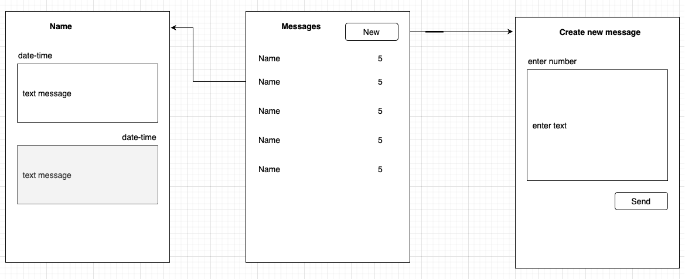

# Урок 12. Принципы тестирования приложений

Сделать ревью всех пунктов последних трех семинаров.

Написать протокол **UAT** тестирования мессенджера.

## UAT - тестирование.

Готовый программный продукт тестирует ограниченный круг пользователей. 

Тестируется каждый кейс из Use case диаграммы. 

При этом группа людей изучает эффективность сервиса, его функционала. 

UAT нужен для того, чтобы понять:

- как ведет себя продукт в реальных условиях, соответствует ли результат задумке;
- выявить, были ли добавлены все возможные функции;
- проверить, есть ли ошибки, которые будут мешать пользователю.

### Таблица тестирования

см. ворд-файл таблицы [table_test](./assest/table_test.docx)

## Ссылки на предыдущие семинары 

### Use-case diagram

### UX design

### ER-model

### сайт проекта

https://gbmessages.elenivan.ru/